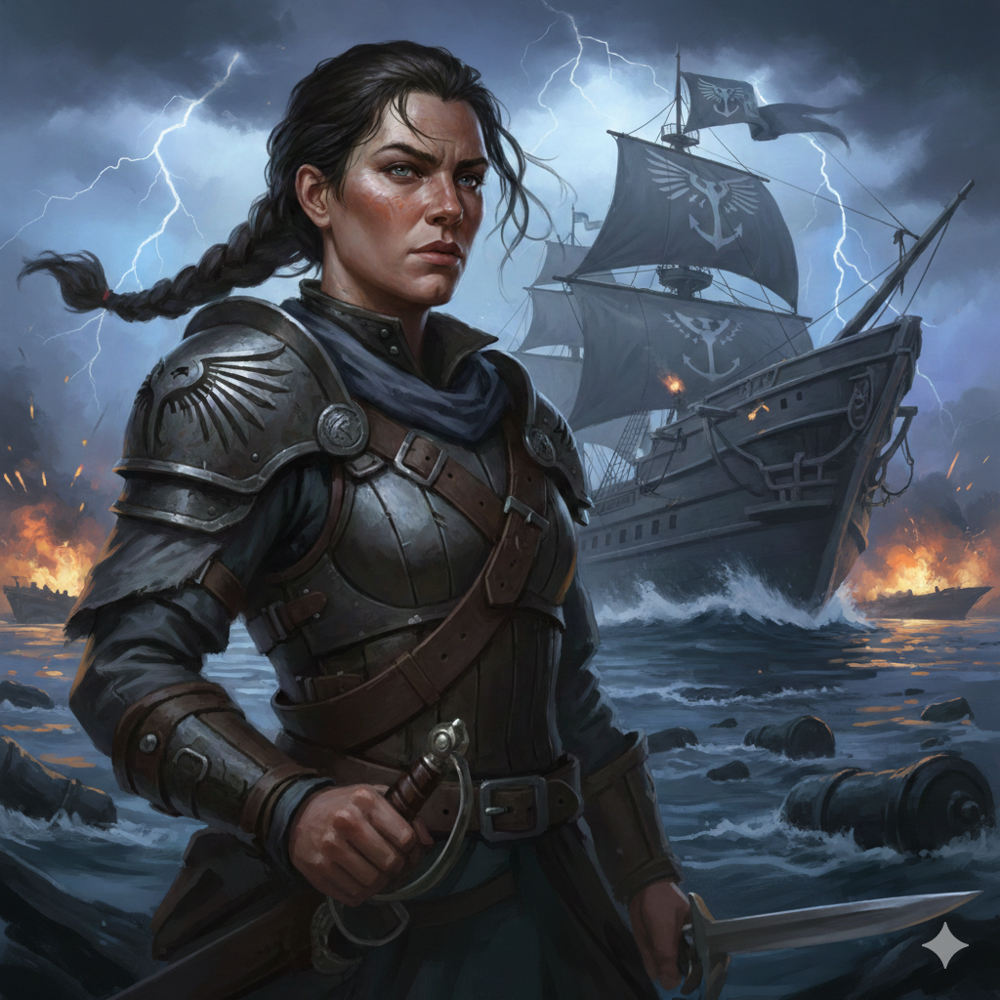

**Faction:** [The Gray Corsairs](../../../Factions/The%20Gray%20Corsairs.md)  
**Role:** Commander, Steel Falcon Veteran, Freedom Fighter

---

**Captain Isla Stormwright** commands [The Gray Corsairs](../../../Factions/The%20Gray%20Corsairs.md) with the fierce conviction of someone who has seen firsthand what tyranny and slavery can do to people. A veteran of the [Steel Falcons](https://pathfinderwiki.com/wiki/Steel_Falcons), Isla earned her reputation liberating enslaved people from Chelish ships and breaking up slaver operations throughout the Inner Sea. Her passionate speeches before the Flotilla Council are legendary equal parts inspirational rhetoric and barely contained fury when discussions turn to "proper governance" that she believes masks colonial ambition. Where [Lord Arbitrator Hadrian Voss](../Assembly%20of%20Accord/Lord%20Arbitrator%20Hadrian%20Voss.md) speaks of frameworks and [Armiger-Magistrate Corvain Thorn](../Chelish%20Expeditionary%20Authority/Armiger-Magistrate%20Corvain%20Thorn.md) invokes law and order, Isla speaks of freedom, justice, and the moral imperative to oppose tyranny wherever it takes root.

Despite her fiery idealism, Isla is no fool. She's a skilled naval tactician and formidable combatant, and she knows the Gray Corsairs cannot win a direct confrontation with the major powers. Her strategy relies on working within [The Assembly of Accord](../../../Factions/The%20Assembly%20of%20Accord.md)'s framework when it serves her goals, building alliances with factions like [The Hands of the Everlight](../../../Factions/The%20Hands%20of%20the%20Everlight.md) who share humanitarian concerns, and leveraging [Tidecaller Rowan](Tidecaller%20Rowan.md)'s invaluable weather magic to make the Gray Corsairs indispensable to the flotilla's success. She walks the razor's edge between principled opposition and open conflict, using every tool at her disposal to ensure the Arcadian Archipelago does not become another monument to imperial exploitation. Those who've served with her note that beneath the passionate speeches lies a pragmatic mind that understands the difference between dying for your principles and living to implement them.
