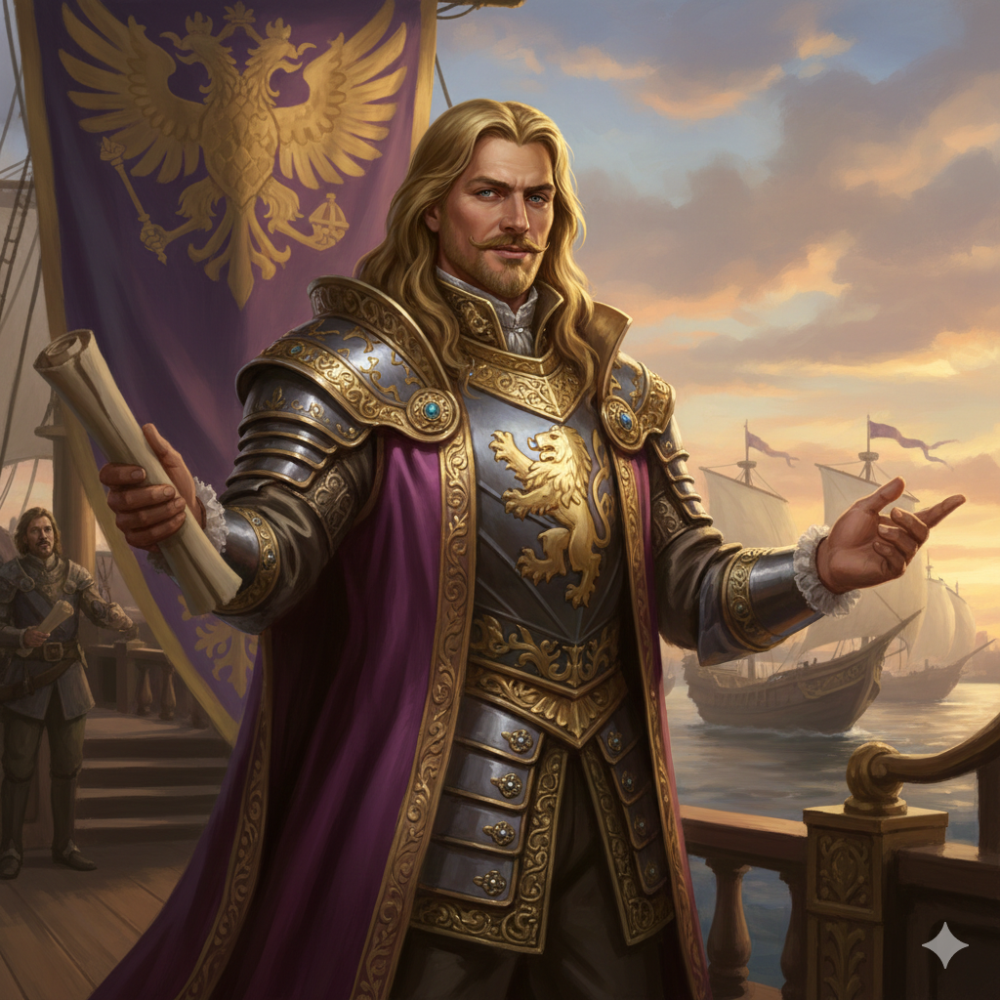

# Ambassador-Envoy Cassius Orell

**Ancestry:** Human (Taldan)
**Alignment:** Lawful Neutral  
**Faction:** [The New Army of Exploration](../../../Factions/The%20New%20Army%20of%20Exploration.md)  
**Role:** Political Representative & Diplomatic Coordinator

---

## Personality

Orell is ambitious, image-obsessed, and utterly tone-deaf to how his rhetoric sounds to anyone who isn't Taldan nobility. He views this expedition as his path to securing a more prestigious position in Oppara's cutthroat aristocratic hierarchy. A successful diplomatic coup here (establishing Taldan territorial claims, securing recognition of Taldor's "natural leadership," or achieving some dramatic achievement worthy of historical commemoration) would elevate him from minor noble to someone important.

He genuinely believes in what he calls "responsible imperialism" the idea that Taldor's centuries of exploratory expertise give them both the right and the duty to guide "less developed peoples" toward "civilized governance." When challenged about this, he grows defensive, insisting there's nothing wrong with believing Taldor has valuable lessons to teach, and that assistance is not exploitation.

In council meetings, Orell speaks in elaborate rhetorical flourishes, frequently referencing historical precedent and invoking the glory of the Armies of Exploration. He emphasizes "partnerships," "mutual benefit," and "cultural exchange," but his vision invariably involves Taldan administration, Taldan governance structures, and Taldan officials in positions of authority.

Unlike *Court Magister Kade*, who pursues his goals through research, or *Surveyor-General Rhen*, who leads through competence, Orell operates through political theater. He gives speeches, hosts diplomatic dinners (aboard his unnecessarily ornate ship), and attempts to build coalitions through charm and social maneuvering.

He is also deeply concerned with his family's dubious claim to being descended from one of the original Armies of Exploration a claim most historians find extremely tenuous but which he repeats at every opportunity. He views this expedition as a chance to prove his lineage's significance through new achievements worthy of the name.

---

## Observed Interactions with Other Factions

Orell appears genuinely unable to understand why others view his vision as problematic. To him, Taldan governance is simply superior, and offering it to others is a kindness. This combination of ambition and obliviousness makes him both ineffective as a diplomat and potentially dangerous if he gains enough authority to act independently.

**[The Assembly of Accord](../../../Factions/The%20Assembly%20of%20Accord.md):** Orell attempts to position Taldor as natural partners with the Assembly, emphasizing their shared commitment to "structured governance" and "proper procedure." However, his attempts to claim Taldan superiority in exploration irritate Assembly officials. [Lord Voss](../Assembly%20of%20Accord/Lord%20Arbitrator%20Hadrian%20Voss.md) treats him with diplomatic courtesy while clearly finding him tiresome.

**[The Chelish Expeditionary Authority](../../../Factions/The%20Chelish%20Expeditionary%20Authority.md):** Orell performatively denounces Cheliax's participation, referencing the Even-Tongued Conquest and insisting that Taldor "will not stand by while former provinces seek to claim what rightfully belongs under experienced exploratory guidance." [Thorn](../Chelish%20Expeditionary%20Authority/Armiger-Magistrate%20Corvain%20Thorn.md) ignores him entirely, which infuriates Orell more than direct confrontation would.

**[The Gray Corsairs](../../../Factions/The%20Gray%20Corsairs.md):** The relationship is deeply strained. [Captain Isla Stormwright](../Gray%20Corsairs/Captain%20Isla%20Stormwright.md) views Orell's "civilized annexation" rhetoric as colonialism with better marketing. Orell protests that democratic revolutionaries "fail to appreciate the value of experienced governance," earning him open contempt from the Corsairs.

**[The Hands of the Everlight](../../../Factions/The%20Hands%20of%20the%20Everlight.md):** [High Healer Valerius](../Hands%20of%20the%20Everlight/High%20Healer%20Valerius.md) has minimal patience for Orell's political theater. When he speaks of "bringing civilization" to the archipelago, she has been known to remind him sharply that "healing the sick requires medicine, not speeches."

**[The Red Wake](../../../Factions/The%20Red%20Wake.md):** Orell repeatedly protests "consorting with pirates," viewing [Marlowe](../The%20Red%20Wake/Captain%20Serafina%20Marlowe.md) as a stain on the flotilla's dignity. Marlowe enjoys needling him about what "respectable nobility" would think of his association with her navigational knowledge.

---

## Quote

 > 
 > *"There is a difference between exploitation and guidance. We do not seek to dominate we seek to assist less developed peoples in realizing their potential through structured governance and proper administration."*

---
