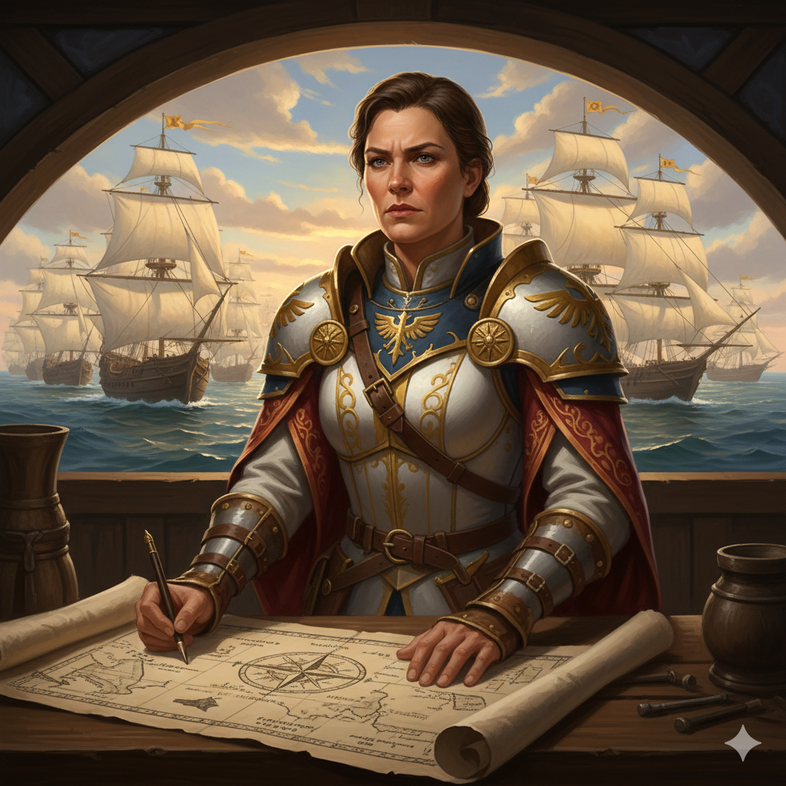

# Surveyor-General Octavia Rhen

**Ancestry:** Human (Taldan)  
**Class/Profession:** Fighter/Military Officer  
**Alignment:** Lawful Good  
**Faction:** [The New Army of Exploration](../../../Factions/The%20New%20Army%20of%20Exploration.md)  
**Role:** Military Commander & Delegation Chair

---

## Personality

Rhen is methodical, disciplined, and increasingly frustrated. She genuinely believes that Taldor can reclaim its legacy as a nation of explorers without repeating the sins of colonial conquest. To her, exploration is about discovery, mapping, and understanding - not domination. She has stated publicly that "the Armies of Exploration became armies of conquest, and that's where we lost our way."

In council meetings, she is practical. She focuses on operational realities: navigation, supply lines, weather patterns, and risk assessment. When others engage in lengthy political debates, she has been observed making detailed notes on charts, clearly waiting for the discussion to return to more actionable matters.

Her frustration with her fellow triumvirate leaders is concealed but only to mixed results. When *Court Magister Kade* proposes diverting resources to archaeological expeditions, her jaw tightens. When *Ambassador-Envoy Orell* speaks of "civilized annexation," she has been seen rubbing her temples. She maintains professional courtesy, but those who work closely with her gossip that she spends considerable energy preventing her colleagues from undermining the delegation's credibility.

Rhen is fiercely proud of Taldor's exploratory expertise while deeply aware of its historical failures. She references [Linvarre's](https://pathfinderwiki.com/wiki/Linvarre) independence frequently, noting that even colonies founded with good intentions eventually and rightfully seek their own path. She has imposed strict rules of engagement on Taldan scouts: no aggressive action against indigenous populations, no seizure of artifacts without permission, no territorial claims without legal justification.

---

## Role in the Expedition

As military commander and nominal chair of the delegation, Rhen coordinates Taldan scouts, surveyors, and navigational experts.

Rhen wants to share this expertise freely to build goodwill and demonstrate that Taldor can contribute without expecting territorial rewards. However, her colleagues constantly undermine this approach. *Kade* wants to hoard navigational data as leverage. *Orell* wants to use expertise as proof of Taldan superiority.

The result is a delegation that simultaneously provides valuable assistance while appearing politically rudderless. Rhen's competence is acknowledged; her leadership is pitied.

---

## Observed Interactions with Other Factions

**[The Assembly of Accord](../../../Factions/The%20Assembly%20of%20Accord.md):** Rhen maintains positive working relationships with [Admiral Lysandra Korvus](../Assembly%20of%20Accord/Admiral%20Lysandra%20Korvus.md) and [Lord Arbitrator Hadrian Voss](../Assembly%20of%20Accord/Lord%20Arbitrator%20Hadrian%20Voss.md). She and Korvus share military backgrounds and mutual respect for operational competence. However, the rivalry between *Kade* and [Magister Vael](../Assembly%20of%20Accord/Magister%20Tertius%20Vael.md) creates constant diplomatic complications that Rhen must manage.

**[The Chelish Expeditionary Authority](../../../Factions/The%20Chelish%20Expeditionary%20Authority.md):** Rhen has attempted to establish professional courtesy with [Armiger-Magistrate Thorn](../Chelish%20Expeditionary%20Authority/Armiger-Magistrate%20Corvain%20Thorn.md), viewing him as another military officer trying to fulfill his duty. Thorn dismisses her efforts, treating Taldor as "proof that incompetence devours even the mightiest empire."

**[The Hands of the Everlight](../../../Factions/The%20Hands%20of%20the%20Everlight.md):** [High Healer Valerius](../Hands%20of%20the%20Everlight/High%20Healer%20Valerius.md) respects Rhen's genuine commitment to ethical exploration. However, Valerius remains suspicious of whether Taldor as a whole has truly learned from its colonial past or is simply rebranding exploitation.

**[The Gray Corsairs](../../../Factions/The%20Gray%20Corsairs.md):** Rhen and [Captain Isla Stormwright](../Gray%20Corsairs/Captain%20Isla%20Stormwright.md) share surprisingly cordial professional relations. Both are practical operators frustrated by political posturing. The Gray Corsairs respect Rhen's ethics while remaining deeply suspicious of *Orell's* rhetoric. They openly hope to outlast Orell's influence on the delegation and support Rhen in maintaining a more pragmatic approach very much in alignment with their goals.

**[The Red Wake](../../../Factions/The%20Red%20Wake.md):** Rhen treats [Captain Marlowe](../The%20Red%20Wake/Captain%20Serafina%20Marlowe.md) with professional respect, recognizing competence when she sees it. Unlike *Orell*, who protests "consorting with pirates," Rhen has quietly benefited from Marlowe's navigational insights and her approval for female leadership.

---

## Quotes

 > 
 > *"Exploration is about discovery, mapping, understanding. The moment it became about domination, we stopped exploring and started conquering. That's where we lost our way."*

---

## Notes

If there are [Lion Blades](https://pathfinderwiki.com/wiki/Lion_Blades) embedded in the delegation, Rhen has publicly stated she cannot confirm or deny their presence, which most interpret as confirmation.
