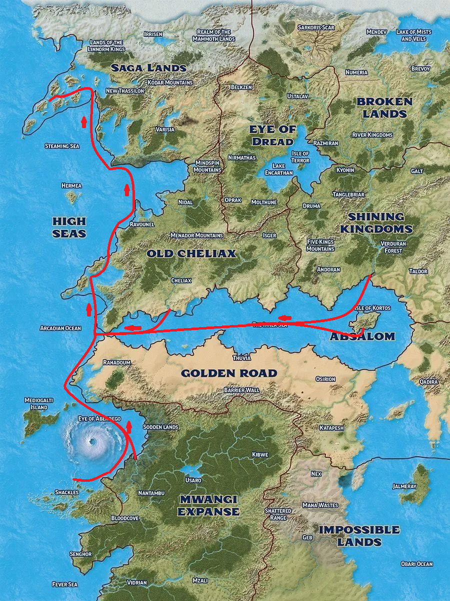

# Campaign Overview

The Arcadian Archipelago is a vast chain of tropical islands in the distant reaches of the known world, rumoured to be the remnants of an ancient civilisation that wielded powerful magic.

A massive international flotilla — assembled under pressure from *The Hands of the Everlight* following prophecies of a coming plague — has finally set sail, carrying not just supplies and healers, but the competing agendas of a dozen nations.

## Route

